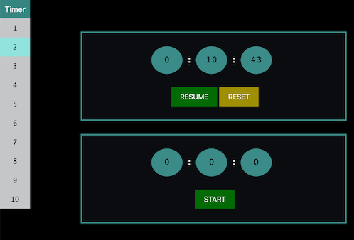

# Multi Stopwatch

- **Created for the Neurobiology of Memory lab at the University of Texas at Dallas for neural engineering and studies on PTSD**

* **Use the dropdown to render up to 10 timers to time processes concurrently**

## Preview:

## Live Site:

- [Multi Stopwatch](https://multistopwatch.netlify.app/)

## Dependencies

- Made with React
